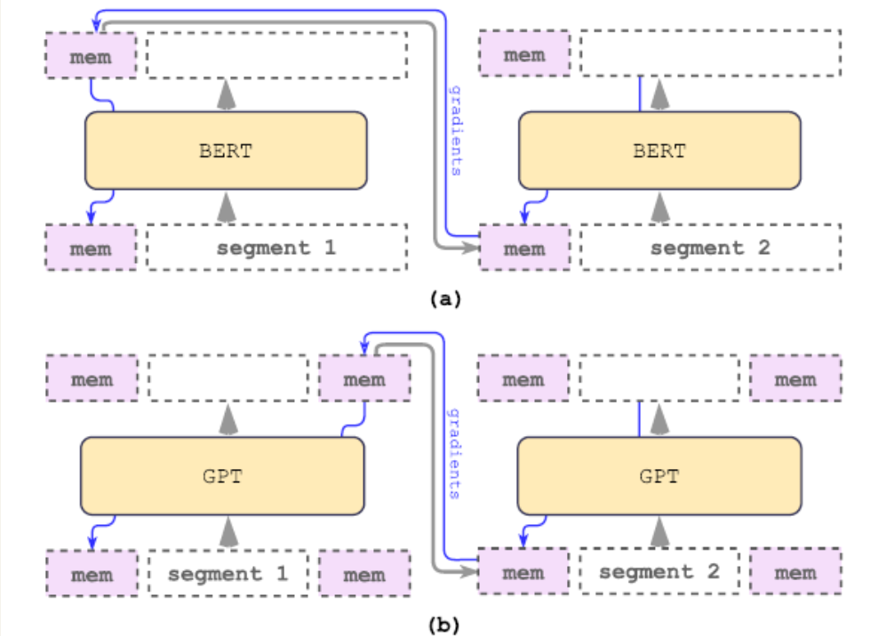
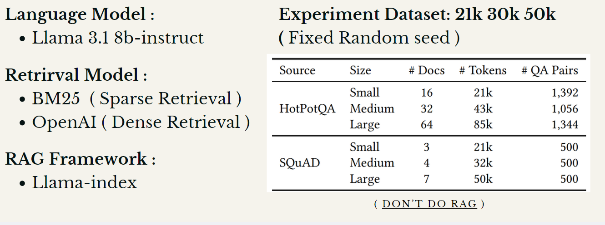
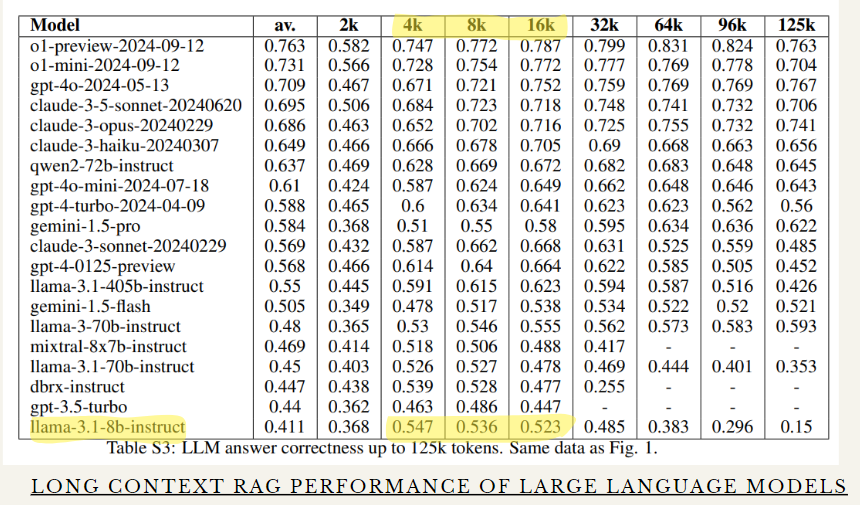
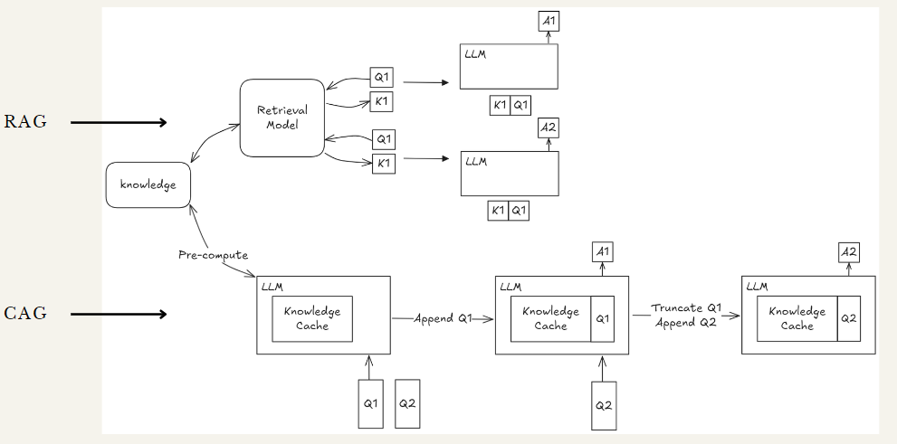
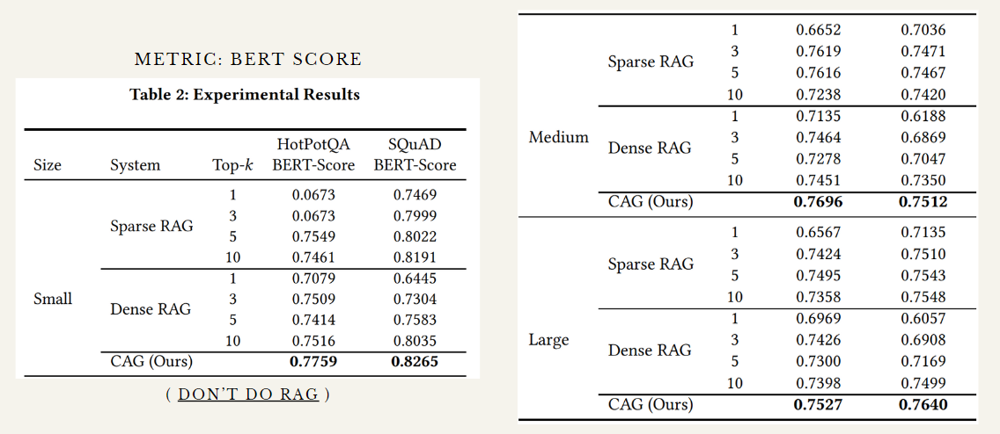
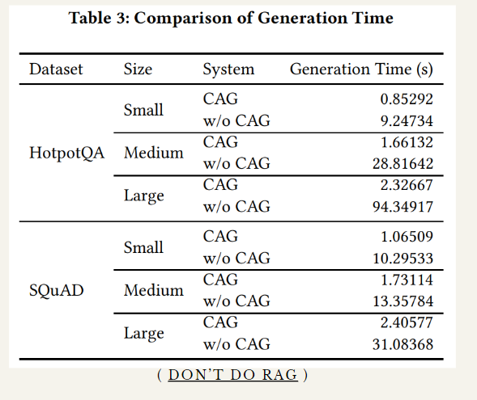

## Deep Learning Final Project Report

### Title: Beyond Attention: Breaking the Limits of Transformer Context Length with Recurrent Memory

#### Authors:
NCCU Computer Science Senior Students  
- 鄭睿宏 (110703007)  
- 潘煜智 (110703013)  

### Abstract:
This report explores the Recurrent Memory Transformer (RMT) as a solution to overcome the context length limitations of traditional transformers. By integrating token-based memory augmentation, RMT extends context length from 128k tokens to over 2 million tokens, enabling efficient handling of long-term dependencies. The proposed approach maintains computational efficiency, enhances scalability, and supports seamless integration with pre-trained models like BERT and GPT-2.

---

### Introduction:
Transformers have become a cornerstone of modern natural language processing tasks. However, their quadratic computational complexity poses significant challenges when processing long sequences. Traditional solutions, such as memory-augmented neural networks and modified attention mechanisms, often require complex architectural changes or remain constrained by hardware limitations. This project investigates RMT, which introduces recurrent memory mechanisms to address these bottlenecks without sacrificing performance or scalability.

#### Background:
Transformers like BERT and GPT have revolutionized NLP tasks due to their ability to model complex dependencies in data. However, the self-attention mechanism becomes computationally expensive for long sequences. Memory-augmented neural networks and alternatives like Transformer-XL have partially addressed this issue but face limitations in scalability and integration.

---

### Problem Statement:
The limitations of traditional transformers in handling long sequences effectively has prompted research into alternative architectures. Key questions include:

1. Can RMT enable efficient handling of extended context lengths?
2. How does RMT applied to pre-trained models without significant modifications?
3. How does RMT compare to Retrieval Augmented Generation (RAG) frameworks for long-context tasks?

#### Significance:
The increasing demand for models that handle long-term dependencies, such as in legal document analysis, bioinformatics, and large-scale language understanding, highlights the necessity of scalable solutions. Addressing these demands efficiently could transform industries reliant on long-context data processing.

The RMT solution delivers significant advancements:
- Enpands sequences handling from 128k tokens to 2 million tokens.
- Supports long-term dependency tasks in natural language understanding and generation.
- Improves scalability for memory-intensive applications

---

### Methodology:
To address the challenges of scaling transformers for long-context tasks, the paper outline a comprehensive methodology that integrates novel architectural innovations with practical training techniques, ensuring both effectiveness and ease of adoption.

#### Recurrent Memory Transformer (RMT):
The Recurrent Memory Transformer introduces a mechanism for handling extended sequences efficiently by leveraging memory tokens and segmented processing, making it a robust solution for overcoming the input length limitations of traditional transformers.

- **Memory Tokens**:
    - Prepend memory tokens to input/output sequences.
    - Memory tokens act as a bridge between segmented sequences, enabling the model to retain and reuse contextual information across large input spans, thereby addressing long-term dependency challenges.
- **Segmented Processing** :
    - Long sequences are segmented, and memory is passed recurrently between segments.
    - By dividing long sequences into manageable segments and recurrently passing memory between them, RMT ensures computational feasibility while preserving information continuity.
- **Plug-and-Play Integration** :
    - RMT is implemented as a wrapper for pre-trained transformers, allowing seamless adoption.
    - Designed as a lightweight wrapper, RMT seamlessly integrates with pre-trained transformers, facilitating its adoption without requiring extensive architectural modifications.

#### Curriculum Learning:
- Begin with short sequences during fine-tuning.
- Gradually increase input lengths to stabilize training.

### Discussion:
RMT’s linear computational scaling and memory token augmentation present significant advancements over existing methods. Unlike prior approaches, RMT avoids architectural complexities and hardware limitations, making it an attractive solution for tasks requiring extended contexts. Furthermore, its compatibility with closed-source language models broadens its applicability.

#### Limitations:
- Memory token storage may introduce challenges for extremely large datasets.
- Requires extensive fine-tuning to achieve optimal performance.

### Conclusion:
The Recurrent Memory Transformer (RMT) addresses the key limitations of traditional transformers by significantly extending their context length capabilities while maintaining efficiency and scalability. By leveraging memory tokens and recurrent mechanisms, RMT simplifies integration into pre-trained models, offering a practical solution for real-world applications.

#### Future Work:
- Expanding RMT’s application to multi-modal data.
- Exploring hardware-specific optimizations to further enhance efficiency.

---

### Experiments: Exploring the value of long context in the Era of RAG
[(Don't Do RAG: When Cache-Augmented Generation is All You Need for Knowledge Tasks)](https://arxiv.org/abs/2412.15605)

#### Introduction: 
In the rapidly evolving field of natural language processing, Retrieval-Augmented Generation (RAG) has emerged as a widely adopted paradigm for enhancing language model performance by integrating external knowledge sources. 

This experiment explores the potential of long context generation inferencing for question answering holds its own value in the era of RAG. Moreover, optimizing the long context interference with Cache-Augmented Generation (CAG)  by preloading a constrained and manageable set of knowledge resources directly into the model’s context, CAG bypasses the need for real-time retrieval, reducing system complexity and mitigating retrieval-related errors.

Through evaluations on datasets such as SQuAD, HotpotQA, and TriviaQA, and using advanced metrics like BERTScore, this study investigates how CAG compares to traditional RAG pipelines. The goal is to assess whether CAG can achieve similar or superior performance while providing significant efficiency gains, particularly in scenarios with a limited knowledge base.

#### Experiment Design:
- **Datasets:** SQuAD, HotpotQA, and TriviaQA.
- **Baseline Models:** Llama 3.1 (8b-instruct) for language modeling.
- **Retrieval Techniques:** BM25 (sparse) and OpenAI embeddings (dense).
- **Evaluation Metrics:** BERTScore for performance and computational efficiency metrics for acceleration.

#### Interference Language Model
Choosing the the datasets document length is because of the long context ability of the Llama 3.1 8b. 

ref: https://arxiv.org/abs/2411.03538v1

#### Structure:

---

### Results:
<!-- TODO -->
1. **Performance:**
   - CAG demonstrated superior handling of long contexts compared to standard transformers.
   - Efficient integration with existing pre-trained models enabled faster training and inference.

2. **Acceleration:**
   - Cache-Augmented Generation (CAG) further reduced computational overhead, leveraging kvcache for knowledge storage and retrieval.

3. **Comparison to RAG:**
   - CAG outperformed RAG in terms of computational efficiency and ease of implementation.

---

#### Source Code: 
Github: https://github.com/hhhuang/CAG

### Thanks:
We thank our advisor and team members for their support and guidance throughout this project. Special thanks to the NCCU Computer Science department for providing computational resources.

---

### References:
<!-- TODO -->
1. Bulatov, A., Kuratov, Y., Kapushev, Y., & Burtsev, M. (2024). *Beyond Attention: Breaking the Limits of Transformer Context Length with Recurrent Memory.* Proceedings of the AAAI Conference on Artificial Intelligence, 38(16), 17700-17708.
2. Brian J Chan, Chao-Ting Chen, Jui-Hung Cheng, & Hen-Hsen Huang. (2024). *Don't Do RAG: When Cache-Augmented Generation is All You Need for Knowledge Tasks.* arXiv preprint, arXiv:2412.15605v1 `[cs.CL]`.

---

<!-- TODO -->
### Appendix:
#### Figures:
1. **RMT Architecture Diagram**
   

2. **Performance Graphs**
   - Graph comparing model performance across datasets.
   - Chart showcasing memory usage efficiency.

#### Tables:
- Table summarizing datasets and model configurations.
- Results table for BERTScore and efficiency metrics.

---

**Note:** Placeholder for images has been added. Please insert appropriate diagrams and graphs to further enhance the visual appeal and readability of the report.
