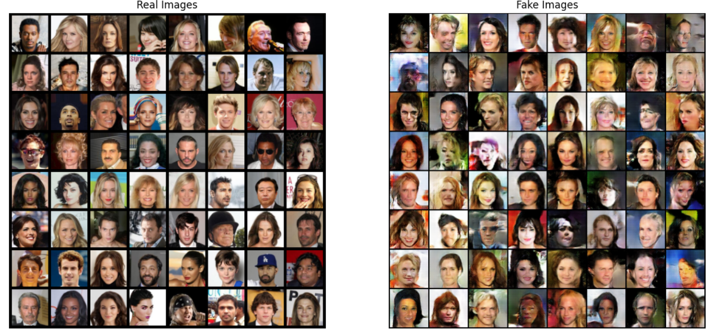
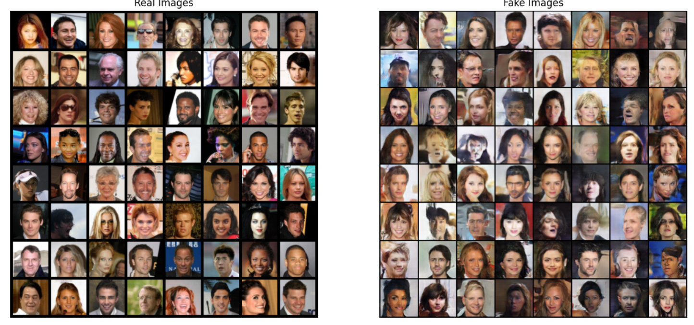

# Deep learning Hw3
> 資科四 110703007 鄭睿宏
> Code 連結:
> https://drive.google.com/drive/folders/1fIKE_6YD-Mo2coyiPpUAL_RB86ppBmFn?usp=drive_link

### GAN
- GAN Real image & Fake image
    - 31846 images with 25 epoch 
    
    - 31846 images with 100 epoch
    

- GAN Loss
  

### Diffusion Model Code:
- Diffusion image
    - 20000 images with 2 epoch
    